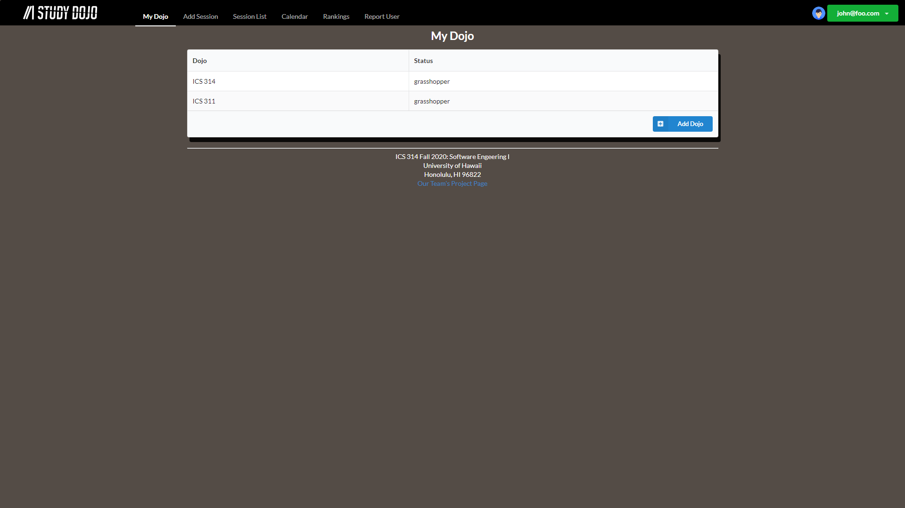

[Study Dojo](https://study-dojo.github.io/) is a site designed to have students - grasshoppers - meet with other students to have study sessions. They are able to create study sessions where they can either be the teacher - sensei - for, or they can attend as a grasshopper. By attending more study sessions, students can accumulate points. Accumulating points allows students to show off their "validity" to others to indicate that they are a regular study session attender.

## Contributions

I assisted in the project by creating the MyDojo page that shows the grasshoppers what classes - dojos - they are registered for. I also helped in creating sample users and implementing TestCafe to test that the pages work. My group and I met regularly each week to discuss what needed to be done and if there were any issues with any of the pages. A lot of discussion occurred in our meetings because we all communicated with each other properly and helped each other with issues. If any of us had issues, the rest of us took the initiative to dwelve into what they had a difficult time with.

## Learning Experience

By doing a group project like this, it has opened a lot for me. It enabled me to see the extent that one person can do. There are lots of things that people can't do on their own, so it's good to be in a group or to have others to assist you. I was also able to learn how to be more vocal with others. I tried to take the initiative in meetings because at first, we weren't too comfortable with each other. It was also because of the fact that ICS 314 was fully online this semester, so we didn't get opportunities to talk to each other outside of this project. In doing so, this helped to break the ice and allowed us to communicate easier throughout the duration of the project.

Future group projects that I participate in will have a much easier time. Learning how to work in a group, as well as using the Issue Driven Project Management style, helped out a lot more than I thought it would. The work was spread out evenly amongst everyone. Because of this, there's a lot I can takeaway from this project, even if it's not ICS related. There are many different situations in which I can use this experience in, and I hope to continue to learn more moving forward.
